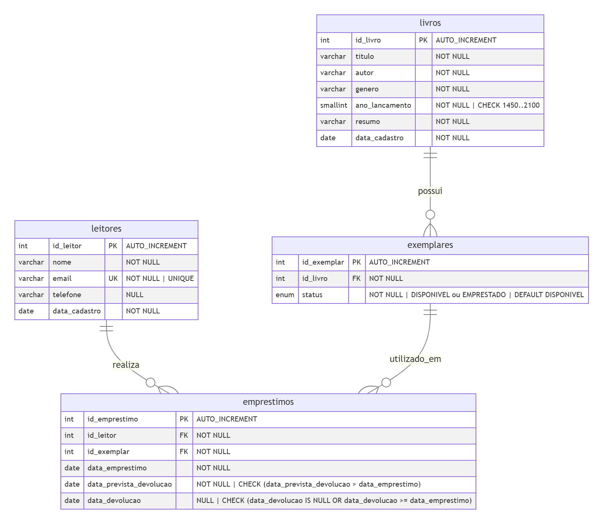

# Book Book — Sistema Gerenciador de Acervo

- **Curso:** Ciência da Computação
- **Turma:** CC4P17 e CC4Q17
- **Disciplina:** Banco de Dados
- **Professor:** Fernando Bueno
- **Avaliação:** NP1

## Identificação Institucional

| Nome Completo | RA |
|---|---|
| Isaque da Silva Andrade Matarazzo | H5209I7 |
| João Guilherme Oliveira dos Santos | H5965D3 |
| João Otavio Santos Vieira | G893IG8 |
| Leonardo Emanuel Marques Cardoso Santos | H163JC8 |
| Roger Aurino Torre de Oliveira | R823EI3 |


---

## Descrição do Projeto

**Book Book** é um sistema gerenciador de acervo desenvolvido para fins acadêmicos. A aplicação permite organizar livros, leitores, exemplares físicos e empréstimos por meio de uma interface web simples e intuitiva.

### Tema e Escopo Funcional

O sistema gerencia o ciclo completo de empréstimo de livros em uma biblioteca: do cadastro do acervo à devolução de exemplares, passando pelo controle de leitores e cópias físicas.

## Acesse o sistema: [trabalho-book-book.vercel.app](https://trabalho-book-book.vercel.app)

Funcionalidades implementadas:

- Cadastro, listagem, pesquisa, edição e exclusão de **livros** (acervo).
- Cadastro, listagem, pesquisa, edição e exclusão de **leitores** (membros da biblioteca).
- Cadastro, listagem e exclusão de **exemplares** (cópias físicas de cada livro), com status controlado automaticamente.
- Registro de **empréstimos** (retirada de exemplares) e **devoluções**, com atualização transacional do status do exemplar no MySQL.
- Histórico permanente: registros vinculados a empréstimos não podem ser excluídos.

### Regras de Negócio (RN)

#### RN-01 a RN-05 — Livros

| RN | Regra | Onde é aplicada |
|---|---|---|
| RN-01 | Título, autor, gênero, ano de lançamento e resumo são obrigatórios. | Model `Livro` (Pydantic) |
| RN-02 | Título: até 200 caracteres; autor: até 150; gênero: até 80; resumo: até 1.000. | Model `Livro` (Pydantic) + DDL `VARCHAR` |
| RN-03 | Ano de lançamento deve estar entre 1450 e o ano corrente. | Model `Livro` + DDL `CHECK (ano_lancamento BETWEEN 1450 AND 2100)` |
| RN-04 | Não pode haver dois livros com mesmo título e autor. | `LivroService.cadastrar` + DDL `UNIQUE (titulo, autor)` |
| RN-05 | Um livro com exemplares cadastrados não pode ser removido. | `LivroService.remover` + DDL `ON DELETE RESTRICT` em exemplares |

#### RN-06 a RN-09 — Leitores

| RN | Regra | Onde é aplicada |
|---|---|---|
| RN-06 | Nome e e-mail são obrigatórios. | Model `Leitor` (Pydantic) |
| RN-07 | E-mail precisa ter formato válido; é armazenado em minúsculas e é único. | Model `Leitor` + DDL `UNIQUE (email)` |
| RN-08 | Telefone é obrigatório e deve ter DDD + número: 10 dígitos para fixo ou 11 dígitos para celular. | Model `Leitor` (Pydantic) |
| RN-09 | Leitor com histórico de empréstimos (ativos ou devolvidos) não pode ser removido. | `LeitorService.remover` + DDL `ON DELETE RESTRICT` em emprestimos |

#### RN-10 a RN-13 — Exemplares

| RN | Regra | Onde é aplicada |
|---|---|---|
| RN-10 | Todo exemplar deve apontar para um livro existente. | DDL `FOREIGN KEY (id_livro) REFERENCES livros` |
| RN-11 | Exemplar novo sempre inicia com status `DISPONIVEL`. | Model `Exemplar` + `ExemplarService.cadastrar` |
| RN-12 | O status do exemplar não pode ser alterado manualmente pela interface. | `ExemplarService`: somente o fluxo de empréstimo/devolução altera o status |
| RN-13 | Exemplar emprestado ou com histórico de empréstimos não pode ser removido. | `ExemplarService.remover` + DDL `ON DELETE RESTRICT` em emprestimos |

#### RN-14 a RN-19 — Empréstimos e Devoluções

| RN | Regra | Onde é aplicada |
|---|---|---|
| RN-14 | Exige leitor e exemplar existentes. | `EmprestimoService.registrar` |
| RN-15 | Apenas exemplar com status `DISPONIVEL` pode ser emprestado. | `EmprestimoService.registrar` + cláusula `AND status = 'DISPONIVEL'` no UPDATE transacional |
| RN-16 | A data do empréstimo não pode estar no futuro. | Model `Emprestimo` (Pydantic) |
| RN-17 | O INSERT em `emprestimos` e o UPDATE de `status` em `exemplares` ocorrem na mesma transação MySQL. | `EmprestimoRepository.registrar` → `Database.executar_transacao` |
| RN-18 | A devolução registra a data atual e volta o exemplar para `DISPONIVEL` na mesma transação. | `EmprestimoRepository.registrar_devolucao` → `Database.executar_transacao` |
| RN-19 | Um empréstimo devolvido permanece no histórico; a devolução não pode ser registrada duas vezes. | `EmprestimoService.registrar_devolucao` + cláusula `AND data_devolucao IS NULL` no UPDATE transacional |

---

## Modelagem de Dados

### Diagrama Entidade-Relacionamento (DER)



## Índices da tabela `emprestimos` - Os índices foram criados para reduzir o tempo de busca nas consultas realizadas sobre a tabela.

| Índice | Coluna | Finalidade |
|--------|---------|------------|
| `idx_emprestimos_leitor` | `id_leitor` | Acelera consultas por leitor. |
| `idx_emprestimos_exemplar` | `id_exemplar` | Acelera consultas por exemplar. |
| `idx_emprestimos_abertos` | `data_devolucao` | Acelera consultas por empréstimos em aberto ou devolvidos. |
| `idx_emprestimos_prevista` | `data_prevista_devolucao` | Acelera consultas por data prevista de devolução. |

O arquivo vetorial editável está em `docs/der.svg`.

**Relacionamentos:**
- Um **livro** pode possuir vários **exemplares** (1:N).
- Um **leitor** pode possuir vários **empréstimos** ao longo do tempo (1:N).
- Um **exemplar** pode aparecer em vários empréstimos ao longo de sua vida, mas apenas um pode estar ativo por vez (1:N; regra garantida pelo fluxo transacional).

### Scripts DDL

Localização: `database/ddl.sql`

```sql
CREATE DATABASE IF NOT EXISTS biblioteca
    DEFAULT CHARACTER SET utf8mb4
    DEFAULT COLLATE utf8mb4_unicode_ci;

USE biblioteca;

DROP TABLE IF EXISTS emprestimos;
DROP TABLE IF EXISTS exemplares;
DROP TABLE IF EXISTS leitores;
DROP TABLE IF EXISTS livros;

CREATE TABLE livros (
    id_livro       INT AUTO_INCREMENT,
    titulo         VARCHAR(200)  NOT NULL,
    autor          VARCHAR(150)  NOT NULL,
    genero         VARCHAR(80)   NOT NULL,
    ano_lancamento SMALLINT      NOT NULL,
    resumo         VARCHAR(1000) NOT NULL,
    data_cadastro  DATE          NOT NULL,

    CONSTRAINT pk_livros PRIMARY KEY (id_livro),
    CONSTRAINT uq_livros_titulo_autor UNIQUE (titulo, autor),
    CONSTRAINT ck_livros_ano CHECK (ano_lancamento BETWEEN 1450 AND 2100),
    INDEX idx_livros_genero (genero),
    INDEX idx_livros_autor (autor),
    INDEX idx_livros_data_cadastro (data_cadastro),
    INDEX idx_livros_ano_lancamento (ano_lancamento)
) ENGINE = InnoDB;

CREATE TABLE leitores (
    id_leitor     INT AUTO_INCREMENT,
    nome          VARCHAR(150) NOT NULL,
    email         VARCHAR(150) NOT NULL,
    telefone      VARCHAR(20)  NOT NULL,
    data_cadastro DATE         NOT NULL,

    CONSTRAINT pk_leitores PRIMARY KEY (id_leitor),
    CONSTRAINT uq_leitores_email UNIQUE (email),
    INDEX idx_leitores_nome (nome)
) ENGINE = InnoDB;

CREATE TABLE exemplares (
    id_exemplar INT AUTO_INCREMENT,
    id_livro    INT NOT NULL,
    status      ENUM('DISPONIVEL', 'EMPRESTADO') NOT NULL DEFAULT 'DISPONIVEL',

    CONSTRAINT pk_exemplares PRIMARY KEY (id_exemplar),
    CONSTRAINT fk_exemplares_livros
        FOREIGN KEY (id_livro) REFERENCES livros (id_livro)
        ON UPDATE CASCADE ON DELETE RESTRICT,
    INDEX idx_exemplares_livro (id_livro),
    INDEX idx_exemplares_status (status)
) ENGINE = InnoDB;

CREATE TABLE emprestimos (
    id_emprestimo   INT AUTO_INCREMENT,
    id_leitor       INT  NOT NULL,
    id_exemplar     INT  NOT NULL,
    data_emprestimo DATE NOT NULL,
    data_devolucao  DATE NULL,

    CONSTRAINT pk_emprestimos PRIMARY KEY (id_emprestimo),
    CONSTRAINT fk_emprestimos_leitores
        FOREIGN KEY (id_leitor) REFERENCES leitores (id_leitor)
        ON UPDATE CASCADE ON DELETE RESTRICT,
    CONSTRAINT fk_emprestimos_exemplares
        FOREIGN KEY (id_exemplar) REFERENCES exemplares (id_exemplar)
        ON UPDATE CASCADE ON DELETE RESTRICT,
    CONSTRAINT ck_emprestimos_datas
        CHECK (data_devolucao IS NULL OR data_devolucao >= data_emprestimo),
    INDEX idx_emprestimos_leitor (id_leitor),
    INDEX idx_emprestimos_exemplar (id_exemplar),
    INDEX idx_emprestimos_abertos (data_devolucao)
) ENGINE = InnoDB;
```

### Dicionário de Dados

#### Tabela `livros`

| Coluna | Tipo | Nulo | Restrições | Descrição |
|---|---|---|---|---|
| `id_livro` | INT | NÃO | PK, AUTO_INCREMENT | Identificador único do livro |
| `titulo` | VARCHAR(200) | NÃO | — | Título da obra |
| `autor` | VARCHAR(150) | NÃO | — | Nome do autor |
| `genero` | VARCHAR(80) | NÃO | — | Gênero literário |
| `ano_lancamento` | SMALLINT | NÃO | CHECK (1450–2100) | Ano de publicação |
| `resumo` | VARCHAR(1000) | NÃO | — | Sinopse ou descrição |
| `data_cadastro` | DATE | NÃO | — | Data de inclusão no sistema |

**Restrições adicionais:** `UNIQUE (titulo, autor)` — impede duplicatas pelo par título+autor.

#### Tabela `leitores`

| Coluna | Tipo | Nulo | Restrições | Descrição |
|---|---|---|---|---|
| `id_leitor` | INT | NÃO | PK, AUTO_INCREMENT | Identificador único do leitor |
| `nome` | VARCHAR(150) | NÃO | — | Nome completo |
| `email` | VARCHAR(150) | NÃO | UNIQUE | Endereço de e-mail (único, armazenado em minúsculas) |
| `telefone` | VARCHAR(20) | NÃO | — | Telefone de contato obrigatório |
| `data_cadastro` | DATE | NÃO | — | Data de inclusão no sistema |

#### Tabela `exemplares`

| Coluna | Tipo | Nulo | Restrições | Descrição |
|---|---|---|---|---|
| `id_exemplar` | INT | NÃO | PK, AUTO_INCREMENT | Identificador único do exemplar |
| `id_livro` | INT | NÃO | FK → `livros.id_livro` | Livro ao qual o exemplar pertence |
| `status` | ENUM | NÃO | DEFAULT 'DISPONIVEL' | `DISPONIVEL` ou `EMPRESTADO`; controlado pelo sistema |

**Índices:** `idx_exemplares_livro (id_livro)`, `idx_exemplares_status (status)`.

#### Tabela `emprestimos`

| Coluna | Tipo | Nulo | Restrições | Descrição |
|---|---|---|---|---|
| `id_emprestimo` | INT | NÃO | PK, AUTO_INCREMENT | Identificador único do empréstimo |
| `id_leitor` | INT | NÃO | FK → `leitores.id_leitor` | Leitor que realizou o empréstimo |
| `id_exemplar` | INT | NÃO | FK → `exemplares.id_exemplar` | Exemplar emprestado |
| `data_emprestimo` | DATE | NÃO | — | Data da retirada |
| `data_devolucao` | DATE | SIM | CHECK (≥ data_emprestimo) | Data da devolução; NULL indica empréstimo ativo |

**Situação derivada:** calculada em código — `NULL` em `data_devolucao` = `ATIVO`; preenchida = `DEVOLVIDO`.
**Índices:** `idx_emprestimos_leitor`, `idx_emprestimos_exemplar`, `idx_emprestimos_abertos (data_devolucao)`.

---

## Aderência às Restrições Técnicas

| Critério | Atendido? | Evidência |
|---|---|---|
| SGBD: MySQL 8+ | ✅ Sim | `database/ddl.sql`, `mysql-connector-python` |
| Back-end: Python | ✅ Sim | `app/` — Python 3.10+ |
| Sem framework no back-end | ✅ Sim | Usa apenas `http.server` (stdlib) e `mysql-connector-python` |
| Sem ORM | ✅ Sim | SQL escrito sem uso de bibliotecas |
| Front-end: HTML5 + CSS3 + JS puro | ✅ Sim | `frontend/` — sem SPA, sem React/Angular/Vue |
| `pydantic>=2.0` (validação de dados) | ✅ Permitido | Biblioteca de validação de tipos de dados, não framework/ORM; não substitui SQL nem gerencia conexão com banco |

> **Nota sobre o Pydantic:** O Pydantic é uma biblioteca Python de validação de dados em tempo de execução, equivalente a um conjunto de `if`/`raise` tipados. Ele não gerencia conexões, não gera SQL, não abstrai o banco — o SQL é inteiramente escrito sem uso de bibliotecas. O uso está dentro das restrições da NP1.

---

## Arquitetura do Sistema

```
Navegador (HTML + CSS + JS puro)
    │  HTTP (JSON)
    ▼
app/core/servidor.py  ← SimpleHTTPRequestHandler (stdlib)
    │  Entrega arquivos estáticos e roteia a API
    ▼
app/services/         ← Regras de negócio e validação (Pydantic)
    │
    ▼
app/repositories/     ← SQL direto via mysql-connector-python
    │
    ▼
app/core/database.py  ← Conexão, transações e rollback MySQL
    │
    ▼
MySQL 8+              ← Persistência real
```

### Responsabilidades por camada

| Arquivo / Pasta | Responsabilidade |
|---|---|
| `app/main.py` | Ponto de entrada; monta a cadeia de dependências e sobe o HTTPServer |
| `app/core/servidor.py` | Roteamento HTTP, entrega de arquivos estáticos, tradução service → JSON |
| `app/core/database.py` | Único arquivo que importa `mysql.connector`; abre conexão, executa SQL e controla transações |
| `app/models/` | Entidades `Livro`, `Leitor`, `Exemplar`, `Emprestimo` com validação Pydantic |
| `app/services/` | Regras de negócio: verifica existência, unicidade, disponibilidade antes de delegar ao repository |
| `app/repositories/` | SQL bruto de cada tabela; jamais conhece regras de negócio |
| `frontend/` | Páginas HTML, CSS e JavaScript do navegador |
| `database/ddl.sql` | Criação do banco e das tabelas com todas as restrições |
| `database/dml_inicial.sql` | Dados de demonstração (10 livros, 5 leitores, 4 exemplares) |
| `config/config.example.py` | Modelo de configuração local sem credenciais |
| `tests/` | Testes automatizados usando repositórios em memória |

---

## Guia de Instalação e Execução

> ⚠️ **Importante:** Execute sempre com `USAR_BANCO_MEMORIA = False` (padrão). O modo em memória não persiste dados no MySQL e não comprova persistência para a avaliação.

### Pré-requisitos

- Python 3.10 ou superior
- MySQL Server 8.0 ou superior (em execução)
- PowerShell (Windows) — ou adaptação para o terminal da sua plataforma

### Passo 1 — Clone ou baixe o repositório

```powershell
git clone https://github.com/matarazzoisaque/TrabalhoBC.git
cd TrabalhoBC
```

Ou descompacte o ZIP e navegue até a pasta raiz do projeto.

### Passo 2 — Crie e ative o ambiente virtual

```powershell
python -m venv .venv
.\.venv\Scripts\Activate.ps1
```

Se o PowerShell bloquear a ativação, execute antes:

```powershell
Set-ExecutionPolicy -Scope Process -ExecutionPolicy Bypass
```

### Passo 3 — Instale as dependências

```powershell
python -m pip install -r requirements.txt
```

Dependências instaladas:

| Pacote | Versão mínima | Uso |
|---|---|---|
| `mysql-connector-python` | 9.0 | Driver nativo de conexão com MySQL |
| `pydantic` | 2.0 | Validação dos dados das entidades |

### Passo 4 — Crie o arquivo de configuração local

```powershell
Copy-Item config\config.example.py config\config.py
```

Abra `config/config.py` e preencha as credenciais do seu MySQL:

```python
DB_HOST = "127.0.0.1"
DB_PORT = 3306
DB_USER = "root"        # seu usuário MySQL
DB_PASSWORD = "senha"   # sua senha MySQL
DB_NAME = "biblioteca"

SERVIDOR_HOST = "127.0.0.1"
SERVIDOR_PORTA = 8000

USAR_BANCO_MEMORIA = False   # ← manter False para persistência real
```

> `config/config.py` está no `.gitignore` e não é enviado para o repositório.

### Passo 5 — Crie o banco e as tabelas

Com o MySQL em execução, execute os scripts na ordem abaixo:

```powershell
Get-Content database\ddl.sql -Raw | mysql -u root -p
Get-Content database\dml_inicial.sql -Raw | mysql -u root -p
```

O primeiro script cria o banco `biblioteca` e as quatro tabelas (`livros`, `leitores`, `exemplares`, `emprestimos`).
O segundo insere os dados de demonstração: 10 livros, 5 leitores e 4 exemplares disponíveis.

**Alternativa via MySQL Workbench:** Abra o Workbench, conecte ao servidor, abra cada arquivo SQL (`File → Open SQL Script`) e execute com ⚡ na mesma ordem.

> ⚠️ O `ddl.sql` remove e recria as tabelas (`DROP TABLE IF EXISTS`). Use-o somente em ambiente de desenvolvimento ou com backup.

### Passo 6 — Inicie a aplicação

```powershell
python -m app.main
```

Saída esperada no terminal:

```
Servidor no ar em http://127.0.0.1:8000
```

Abra **http://127.0.0.1:8000** no navegador. Encerre com `Ctrl+C`.

> ⚠️ Não abra os arquivos HTML diretamente pelo sistema de arquivos (`file://`). O sistema precisa do servidor Python para funcionar.

### Dados disponíveis após a instalação

| Registro | Quantidade |
|---|---:|
| Livros | 10 |
| Leitores | 5 |
| Exemplares disponíveis | 4 |
| Empréstimos | 0 |

### Fluxo de demonstração recomendado

1. Acesse **http://127.0.0.1:8000** → página inicial com acesso rápido ao acervo.
2. Em **Leitores** (`/leitores.html`): cadastre ou selecione um leitor existente.
3. Em **Livros** (`/cadastro.html`): cadastre ou selecione um livro.
4. Em **Exemplares** (`/exemplares.html`): cadastre pelo menos um exemplar para o livro.
5. Em **Empréstimos** (`/emprestimos.html`): selecione leitor e exemplar disponível e registre o empréstimo.
6. Registre a devolução — o exemplar volta para `DISPONIVEL` automaticamente.
7. Confirme no MySQL Workbench que os registros persistem após reiniciar o servidor.

### Solução de problemas

| Situação | O que verificar |
|---|---|
| `Unknown database 'biblioteca'` | Execute `database/ddl.sql` primeiro. |
| `Access denied` | Revise `DB_USER` e `DB_PASSWORD` em `config/config.py`. |
| `mysql` não é reconhecido | Use o MySQL Workbench ou adicione a pasta `bin` do MySQL ao `PATH`. |
| Erro ao ativar `.venv` | Execute `Set-ExecutionPolicy -Scope Process -ExecutionPolicy Bypass`. |
| A página não carrega dados | Inicie com `python -m app.main` e acesse `http://127.0.0.1:8000`. |
| Dados somem ao reiniciar | Confirme que `USAR_BANCO_MEMORIA = False` em `config/config.py`. |
| Erro de chave estrangeira | Cadastre primeiro o livro ou leitor relacionado antes do exemplar ou empréstimo. |

---

## Evidências Visuais

As evidências foram organizadas em `docs/evidencias/` para comprovar a interface, o funcionamento do CRUD e a correspondência com as instruções SQL executadas no MySQL.

Arquivos consolidados:

- [Evidências.pdf](<docs/evidencias/Evidências.pdf>)
- [Evidências.pptx](<docs/evidencias/Evidências.pptx>)
- [Pasta com imagens individuais](<docs/evidencias/Evidências - Imagens/>)

### EV-01 - Listagem de Livros (Read)

**Resumo:** A tela de livros demonstra a operação de leitura do CRUD, exibindo registros cadastrados no MySQL e ordenados para consulta pelo usuário.

**Print da tela:**


**Código SQL relacionado:**

```sql
SELECT id_livro, titulo, autor, genero, ano_lancamento, data_cadastro
FROM livros
ORDER BY data_cadastro DESC;
```

### EV-02 - Modal de Cadastro de Livro (Create)

**Resumo:** O modal preenchido demonstra a operação de criação de livro, com os dados informados na interface antes do envio para gravação no banco.

**Print da tela:**


**Código SQL relacionado:**

```sql
INSERT INTO livros (titulo, autor, genero, ano_lancamento, resumo, data_cadastro)
VALUES (
    'Paulo e Estêvão',
    'Francisco Cândido Xavier',
    'Romance Espírita',
    1932,
    'Pela mediunidade de Chico Xavier, o livro narra a missão apostólica de Paulo e Estêvão nos primeiros anos do Cristianismo.',
    '2026-09-15'
);
```

### EV-03 - Consulta do Livro Cadastrado

**Resumo:** Após o cadastro, a tela de detalhes comprova que o livro foi registrado e pode ser consultado novamente pela aplicação.

**Print da tela:**


**Código SQL relacionado:**

```sql
SELECT *
FROM livros
WHERE titulo = 'Paulo e Estêvão';
```

### EV-04 - Modal de Edição de Leitor (Update)

**Resumo:** O modal de edição demonstra a atualização dos dados de um leitor, alterando e-mail e telefone já existentes no cadastro.

**Print da tela:**


**Código SQL relacionado:**

```sql
UPDATE leitores
SET email = 'carlosedu.lima@email.com',
    telefone = '(11) 99999-0000'
WHERE id_leitor = 2;

-- Verificação
SELECT *
FROM leitores
WHERE id_leitor = 2;
```

### EV-05 - Confirmação de Exclusão de Livro (Delete)

**Resumo:** O modal de confirmação demonstra a operação de exclusão de livro, exigindo confirmação antes de remover o registro do banco.

**Print da tela:**


**Código SQL relacionado:**

```sql
DELETE FROM livros
WHERE id_livro = 8;

-- Verificação
SELECT *
FROM livros;
```

---

## API HTTP

O servidor Python entrega o front-end e a API no mesmo processo — sem CORS nem URL externa.

| Método | Rota | Descrição |
|---|---|---|
| `GET` | `/api/livros` | Lista livros; aceita `busca`, `genero`, `periodo` e `ordem` |
| `GET` | `/api/livros/filtros` | Lista gêneros disponíveis para o filtro |
| `POST` | `/api/livros` | Cadastra livro |
| `PUT` | `/api/livros/{id}` | Edita livro |
| `DELETE` | `/api/livros/{id}` | Exclui livro sem exemplares |
| `GET` | `/api/leitores` | Lista leitores; aceita `busca` |
| `POST` | `/api/leitores` | Cadastra leitor |
| `PUT` | `/api/leitores/{id}` | Edita leitor |
| `DELETE` | `/api/leitores/{id}` | Exclui leitor sem empréstimos |
| `GET` | `/api/exemplares` | Lista exemplares; aceita `busca` e `status` |
| `POST` | `/api/exemplares` | Cadastra exemplar disponível |
| `PUT` | `/api/exemplares/{id}` | Edita exemplar disponível |
| `DELETE` | `/api/exemplares/{id}` | Exclui exemplar sem histórico |
| `GET` | `/api/emprestimos` | Lista empréstimos; aceita `busca` e `situacao` |
| `POST` | `/api/emprestimos` | Registra empréstimo |
| `PUT` | `/api/emprestimos/{id}/devolucao` | Registra devolução |

**Códigos de status:** `200 OK`, `201 Created`, `400 Bad Request`, `404 Not Found`, `503 Service Unavailable` (MySQL inacessível).

### Exemplo — Cadastro de livro

**Requisição:**
```
POST /api/livros
Content-Type: application/json
```
```json
{
  "titulo": "Ensaio sobre a Cegueira",
  "autor": "José Saramago",
  "genero": "Romance",
  "ano_lancamento": 1995,
  "resumo": "Uma cidade enfrenta uma epidemia de cegueira branca."
}
```

**Resposta (201):**
```json
{
  "id_livro": 11,
  "titulo": "Ensaio sobre a Cegueira",
  "autor": "José Saramago",
  "genero": "Romance",
  "ano_lancamento": 1995,
  "resumo": "Uma cidade enfrenta uma epidemia de cegueira branca.",
  "data_cadastro": "2026-09-15"
}
```

---

## Executando os Testes

Os testes usam repositórios em memória e não dependem do MySQL.

```powershell
.\.venv\Scripts\python.exe -m unittest discover -s tests
```

Cobertura atual: `test_livro.py`, `test_leitor.py`, `test_exemplar.py`, `test_emprestimo.py`.

---

## Estrutura do Repositório

```
app/
  core/
    database.py       conexão MySQL e controle de transações
    servidor.py       roteamento HTTP e entrega do front-end
  models/
    livro.py          entidade Livro com validação Pydantic
    leitor.py         entidade Leitor com validação Pydantic
    exemplar.py       entidade Exemplar com validação Pydantic
    emprestimo.py     entidade Emprestimo com validação Pydantic
  repositories/
    livro_repository.py
    leitor_repository.py
    exemplar_repository.py
    emprestimo_repository.py
  services/
    livro_service.py
    leitor_service.py
    exemplar_service.py
    emprestimo_service.py
  main.py             ponto de entrada da aplicação
config/
  config.example.py   modelo de configuração (sem credenciais)
  config.py           configuração local (não versionada)
database/
  ddl.sql             criação do banco e das tabelas
  dml_inicial.sql     dados de demonstração
docs/
  der.png             diagrama ER (imagem)
  der.svg             diagrama ER (vetorial editável)
  evidencias/         capturas de tela
  regras-negocio.md   regras de negócio detalhadas
frontend/
  index.html          página inicial
  cadastro.html       gerenciamento de livros (CRUD)
  leitores.html       gerenciamento de leitores (CRUD)
  exemplares.html     gerenciamento de exemplares (CRUD)
  emprestimos.html    registro de empréstimos e devoluções
  assets/
    css/style.css
    js/api.js         camada de comunicação HTTP do front-end
    js/livros.js
    js/leitores.js
    js/exemplares.js
    js/emprestimos.js
    js/utils.js
tests/
  test_livro.py
  test_leitor.py
  test_exemplar.py
  test_emprestimo.py
requirements.txt      dependências Python
```
